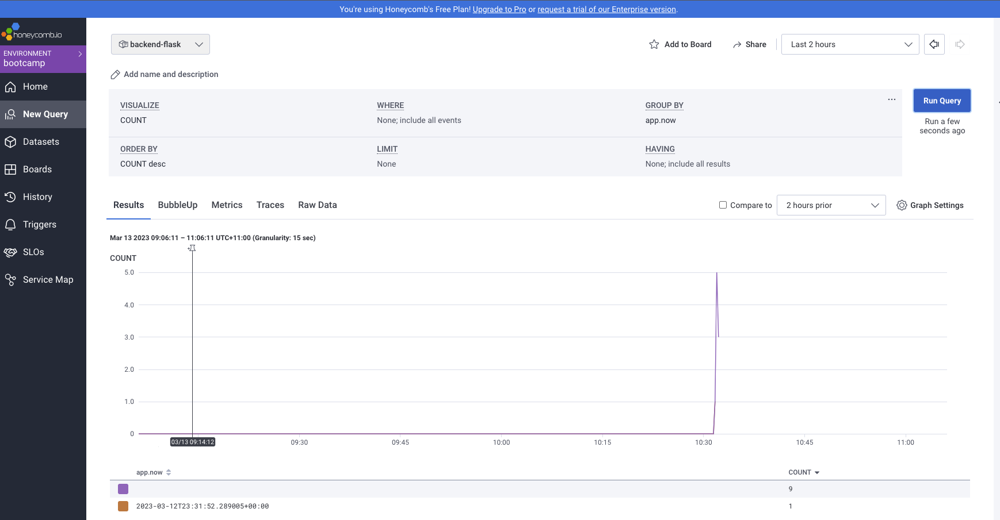
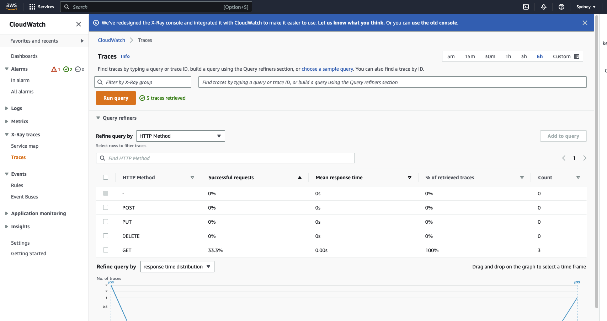
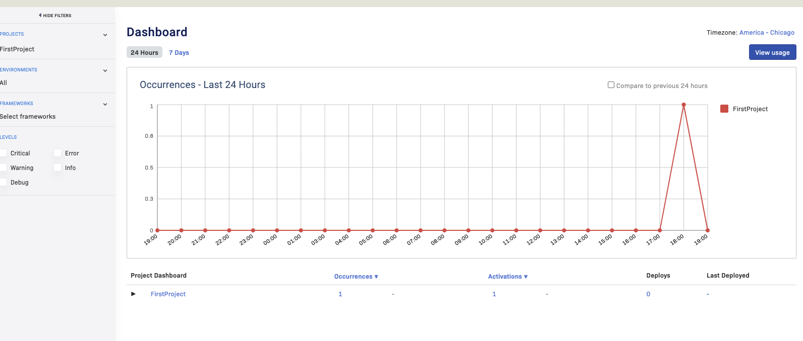

# Week 2 — Distributed Tracing

## Learn about observability using AWS services and other SAAS services.

## Configure backend flask to send logs to Honeycomb.

[Backend - Dockerfile](../backend-flask/Dockerfile)
[Backend - app.py](../backend-flask/app.py)

## Add custom fields and queries logs on Honeycomb.

## Learnt more about limits in free tier for Honeycomb, Rollbar, Xray and Cloudwatch.

## Explore platforms like AWS Xray, Cloud-watch and Rollbar.

## Configured backend flask to use Xray.

## Configured backend flask to use Rollbar.

