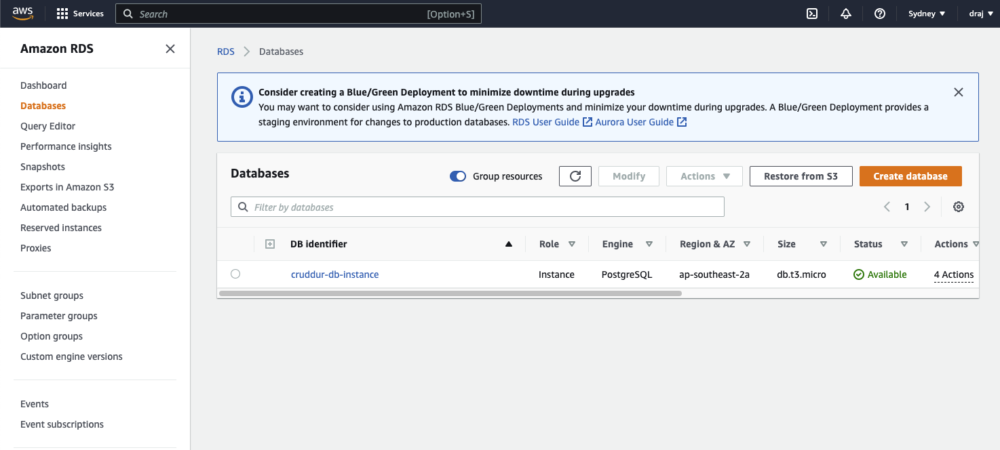
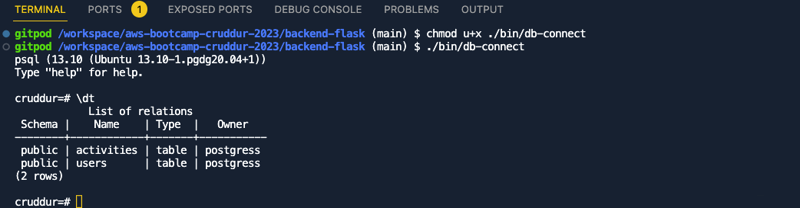

# Week 4 — Postgres and RDS

## Created RDS database via CLI

[RDS created using CLI]

## Created bash scripts to connect, load schema and seed data to RDS locally and on prod

[DB Table using bash commands]

## 